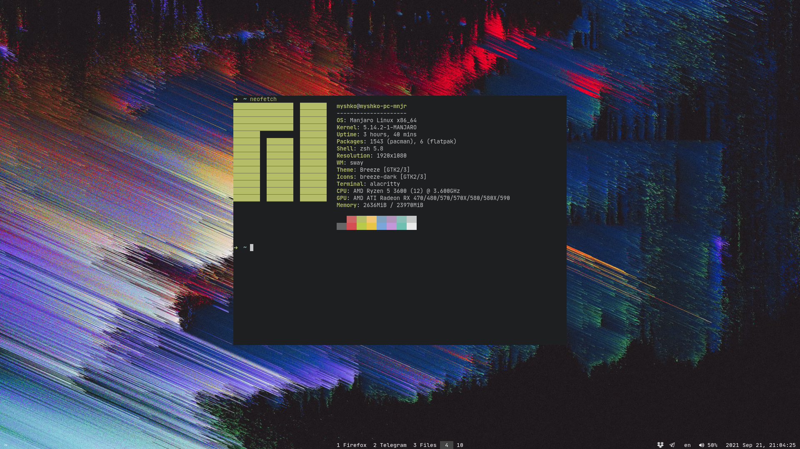
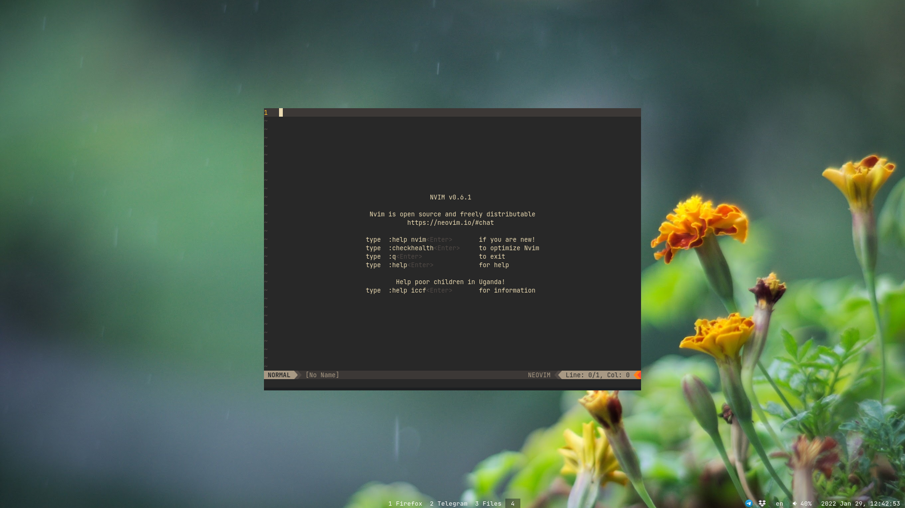
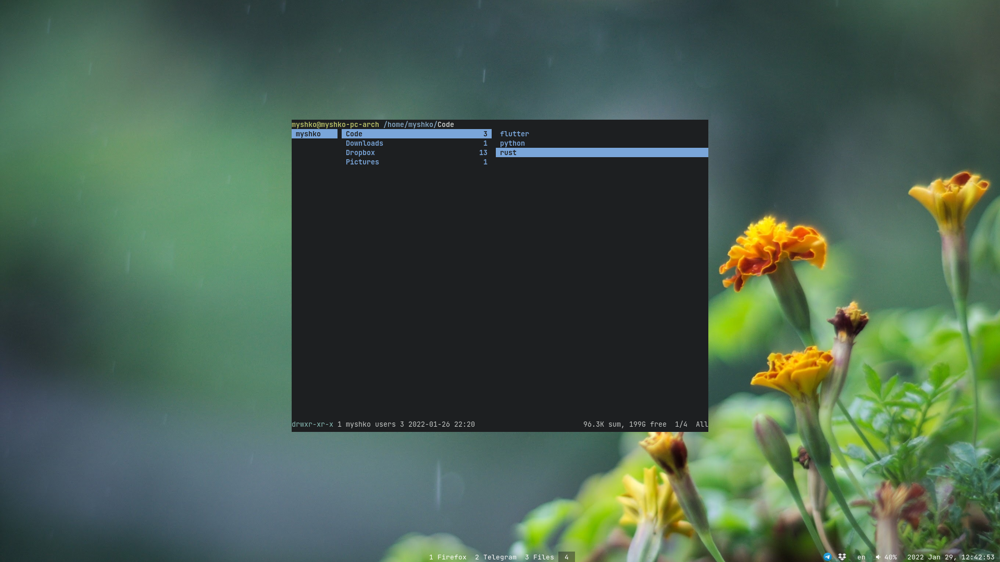

# [dmyTRUEk](https://github.com/dmyTRUEk)'s dotfiles for [Sway](https://swaywm.org/)

I believe it works in [Arch](https://archlinux.org/), [Manjaro](https://manjaro.org/),
and any other [GNU/Linux](https://www.getgnulinux.org/) distro,
where you can install all needed programs.


## Contents:
### Configs:
- [NeoVim](https://github.com/dmyTRUEk/dotfiles/blob/main/nvim/init.vim)
- [Zsh](https://github.com/dmyTRUEk/dotfiles/blob/main/.zshrc) + Oh My ZSH!
- [Sway](https://github.com/dmyTRUEk/dotfiles/blob/main/sway/config)
  - [Alacritty](https://github.com/dmyTRUEk/dotfiles/blob/main/alacritty/alacritty.yml)
  - [Waybar](https://github.com/dmyTRUEk/dotfiles/tree/main/waybar)
  - [Mako](https://github.com/dmyTRUEk/dotfiles/tree/main/mako)
- Git
- [Paru](https://github.com/dmyTRUEk/dotfiles/blob/main/paru/paru.conf)
  \- [yay](https://github.com/Jguer/yay) alanog written in [Rust](https://www.rust-lang.org/)

### Setup Scripts:
- [Dotfiles](https://github.com/dmyTRUEk/dotfiles/blob/main/setup-file-links.sh)
  \- creates symbolic links in desired locations to real dotfiles
  (real dotfiles located in `~/.dotfiles/`)
- [Aliases](https://github.com/dmyTRUEk/dotfiles/blob/main/setup-aliases.sh)
  \- useful for dmenu, creates "aliases" (shell scripts) in `~/.local/bin/`


## Screenshots:






## Useful Add Ons for Sway [here](https://github.com/swaywm/sway/wiki/Useful-add-ons-for-sway)


## Other Sway dotfiles:
- [Sway Default](https://github.com/swaywm/sway/blob/master/config.in)
- [Sunderland93 (yt: Aleksey Samoilov)](https://github.com/Sunderland93/dotfiles-sway)
- [Mel34](https://gist.github.com/Mel34/ab9b6d562f9181ed8bbdc7c76022b85b)
- [fluix-dev](https://github.com/fluix-dev/dotfiles)
- [MIAH7](https://github.com/MIAH7/dotfiles)
- [MuratovAS](https://github.com/MuratovAS/dotfiles)
- [1edenec](https://github.com/1edenec/ledosway)
- [ivanmilov (alacritty)](https://github.com/ivanmilov/dots_work_ttt/blob/master/home_dir/.config/alacritty/alacritty.yml)


## FAQ - Frequently Asked Questions:

### Some symbols doesnt show correctly
Solution: install `ttf-font-awesome` package

### Mouse Cursor in some app is wrong
Solution:

1. Set `XCURSOR_THEME=your_cursor_theme` before launching app

### Screenshare dont work
- in Firefox:  
  Solution: google webrtc?
- in Discord, Telegram:  
  Solution:
  1. Launch OBS
  2. Translate your screen to virtual camera
    if it is not available, install `v4l2loopback-dkms`
  3. Use it in discord/telegram

### Screencasting (screenrecording)
Solution: use [wf-recorder](https://github.com/ammen99/wf-recorder)

### Enviroment variables of two (or more) DE/WM conflicts
Solution:

1. Create file `/usr/local/bin/sway` and write in it:

  ```
  XDG_CURRENT_DESKTOP=sway \
      VAR1=... \
      VAR2=... \
      /usr/bin/sway
  ```
2. Give executable permission to this file: `chmod +x /usr/local/bin/sway`
3. In your `sway.desktop` file (located in `/usr/share/wayland-sessions`) edit `Exec=sway` to `Exec=/usr/local/bin/sway`

### Run JetBrains (or other Java based apps)
Solution: `_JAVA_AWT_WM_NONREPARENTING=1\n<your_app_name>`


