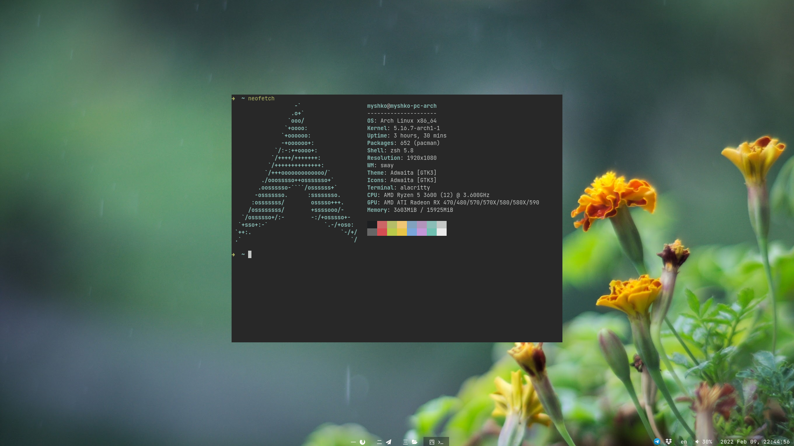

# [dmyTRUEk](https://github.com/dmyTRUEk)'s dotfiles

It works on [Arch](https://archlinux.org/), [Manjaro](https://manjaro.org/),
and any other [GNU/Linux](https://www.getgnulinux.org/) distro,
where you can install all needed programs.


## Contents:
### Configs:
- NeoVim: [init.vim](https://github.com/dmyTRUEk/dotfiles/blob/main/nvim/init.vim)
- Zsh + Oh My ZSH!: [.zshrc](https://github.com/dmyTRUEk/dotfiles/blob/main/.zshrc)
  \+ [.zprofile](https://github.com/dmyTRUEk/dotfiles/blob/main/.zprofile)
- Ranger: [rc.conf](https://github.com/dmyTRUEk/dotfiles/blob/main/ranger/rc.conf)
  \+ [rifle.conf](https://github.com/dmyTRUEk/dotfiles/blob/main/ranger/rifle.conf)
  \+ [colorschemes/ala_gruvbox.py](https://github.com/dmyTRUEk/dotfiles/blob/main/ranger/colorschemes/ala_gruvbox.py)
- Zathura: [zathurarc](https://github.com/dmyTRUEk/dotfiles/blob/main/zathura/zathurarc)
- Paru: [paru.conf](https://github.com/dmyTRUEk/dotfiles/blob/main/paru/paru.conf)
- Alacritty: [alacritty.yml](https://github.com/dmyTRUEk/dotfiles/blob/main/alacritty/alacritty.yml)
- Sway: [config](https://github.com/dmyTRUEk/dotfiles/blob/main/sway/config)
  - Waybar: [config](https://github.com/dmyTRUEk/dotfiles/blob/main/waybar/config)
    \+ [style.css](https://github.com/dmyTRUEk/dotfiles/blob/main/waybar/style.css)
    \+ [modules/kblayout](https://github.com/dmyTRUEk/dotfiles/blob/main/waybar/modules/kblayout)
  - Mako: [config](https://github.com/dmyTRUEk/dotfiles/blob/main/mako/config)
  - Swaylock: [config](https://github.com/dmyTRUEk/dotfiles/blob/main/swaylock/config)
  - Yofi: [yofi.config](https://github.com/dmyTRUEk/dotfiles/blob/main/yofi/yofi.config)
    \+ [yofi_with_allowlist.py](https://github.com/dmyTRUEk/dotfiles/blob/main/yofi/yofi_with_allowlist.py)

### Setup Scripts:
- [setup-file-links.sh](https://github.com/dmyTRUEk/dotfiles/blob/main/setup-file-links.sh)
  \- creates symbolic links in desired locations to real dotfiles
  (real dotfiles located in `~/.dotfiles/`)


## Screenshots:



## Useful Links:
- [Useful add ons for sway](https://github.com/swaywm/sway/wiki/Useful-add-ons-for-sway)


## Other Sway dotfiles:
- [Sway Default](https://github.com/swaywm/sway/blob/master/config.in)
- [Sunderland93 (yt: Aleksey Samoilov)](https://github.com/Sunderland93/dotfiles-sway)
- [Mel34](https://gist.github.com/Mel34/ab9b6d562f9181ed8bbdc7c76022b85b)
- [fluix-dev](https://github.com/fluix-dev/dotfiles)
- [MIAH7](https://github.com/MIAH7/dotfiles)
- [MuratovAS](https://github.com/MuratovAS/dotfiles)
- [1edenec](https://github.com/1edenec/ledosway)
- [ivanmilov (alacritty)](https://github.com/ivanmilov/dots_work_ttt/blob/master/home_dir/.config/alacritty/alacritty.yml)
- [kraftwerk28](https://github.com/kraftwerk28/dotfiles)


## Sway FAQ - Frequently Asked Questions:

### Some symbols isn't displayed correctly
Solution: install `ttf-font-awesome` package.

### Wallpaper (Background) doesn't change
Solution: install `swaybg` package.

### Mouse Cursor in some app is wrong
Solution: set `XCURSOR_THEME=your_cursor_theme` before launching app.

### Screenshare doesn't work
- in Firefox:  
  Solution: google webrtc?
- in Discord, Telegram:  
  Solution:
  1. Launch OBS
  2. Translate your screen to virtual camera
    if it is not available, install `v4l2loopback-dkms`
    (or follow [this tutorial](https://github.com/hw0lff/screen-share-sway#Install-the-v4l2loopback-kernel-module)).
  3. Enable (virtual) camera in discord/telegram.

### Screenrecording
Solution: use OBS or [wf-recorder](https://github.com/ammen99/wf-recorder)

### Enviroment variables of two (or more) DE/WM conflicts
Solution:

1. Create file `/usr/local/bin/sway` and write in it:

  ```
  XDG_CURRENT_DESKTOP=sway \
      VAR1=... \
      VAR2=... \
      /usr/bin/sway
  ```
2. Give executable permission to this file: `chmod +x /usr/local/bin/sway`
3. In your `sway.desktop` file (located in `/usr/share/wayland-sessions`) edit `Exec=sway` to `Exec=/usr/local/bin/sway`

### Run JetBrains (or maybe other Java based apps)
Solution: `_JAVA_AWT_WM_NONREPARENTING=1 <your_app_name>`

Or add `env _JAVA_AWT_WM_NONREPARENTING=1` to app's `.desktop` file


# TODO:
- make better lock screen bind: win+esc -> win+caps (but my esc & caps are swapped)
- fix all icons in waybar
- make meta+shift+enter terminal be in scratchpad by default
- internet sometimes don't work


