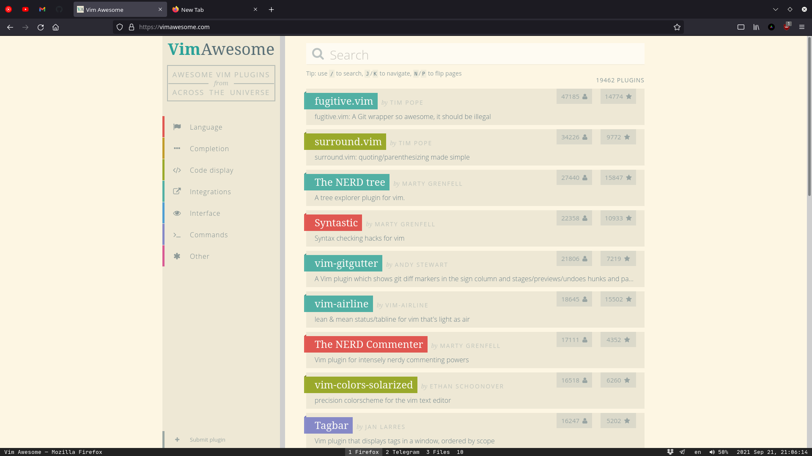
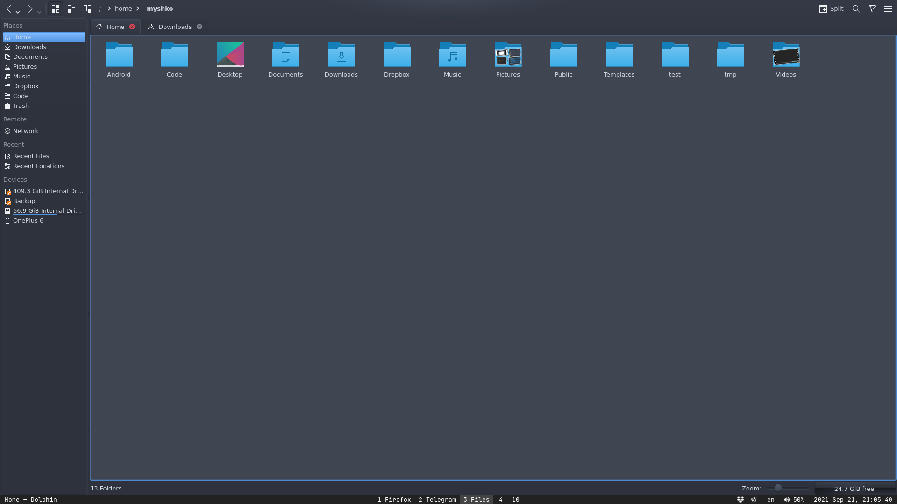

# [dmyTRUEk](https://github.com/dmyTRUEk)'s dotfiles for [Sway](https://swaywm.org/)

I believe it works in [Arch](https://archlinux.org/), [Manjaro](https://manjaro.org/),
and other distros, where you can install all needed programs.

## List of programs:
- [Vim](https://www.vim.org/) + [NeoVim](https://neovim.io/)
- [Zsh](https://www.zsh.org/) + [Oh My ZSH!](https://ohmyz.sh/)
- [Git](https://git-scm.com/)
- [Sway](https://swaywm.org/)
  - [Alacritty](https://github.com/alacritty/alacritty)
  - [Waybar](https://github.com/Alexays/Waybar)
  - [Mako](https://github.com/emersion/mako)
- \+ My custom aliases, which are useful for dmenu

## Screenshots:

